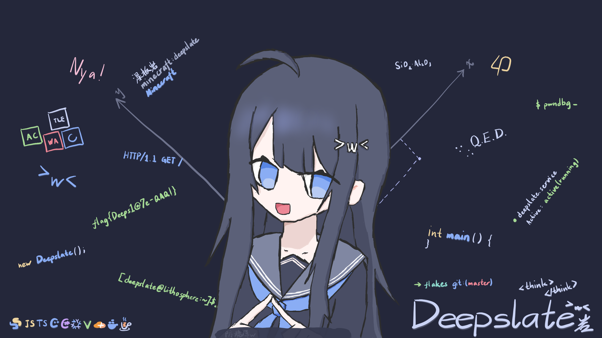

```plain
[    0.000000] Lithosphere-Core version 15.8-alpha (nixbld@localhost) (gcc (GCC) 15.3.0, GNU ld (GNU Binutils) 2.46) #1-Lithosphere-Core ZEN SMP PREEMPT_DYNAMIC Tue Jan  1 00:00:00 UTC 1980
[    0.000000] Command line: initrd=\EFI\lithosphere\am13cwcwdil1q5y74vndawcg8yhfxgma-initrd-lithosphere-15.8-initrd.efi init=/nix/store/c4snh8rlcs64yyh9axjsygycsw2zqd26-lithosphere-system-lithosphere-15.8.ff98c01/init quiet splash splash boot.shell_on_fail root=fstab
[    0.000000] BIOS-provided physical RAM map:
[    0.000000] BIOS-e820: [mem 0x0000000000000000-0x7fffffffffffffff] System RAM
...
[    0.000000] DMI: LithoD, BIOS LithoD 04/09/2026
...
[    0.101221] Loading initial ramdisk...
...
[    9.982443] systemd[1]: Reached target DeepslateQAQ.
...

<<< Welcome to Lithosphere-Core 15.8.ff98c01 (x86_64) - tty1 >>>

lithosphere login: deepslate
Password:

[deepslate@lithosphere:~]$ cat ~/README.md
```

<div align="center">



# [[ 深板岩酱 // Deepslate ]]

**「一块板岩是平凡而脆弱的，但它的每一片岩层都有自己的故事。」**


Hi, this is **DeepslateQAQ**, the successor generation of "last generation" -- AstralFlare.

Currently 15 years old, living in Shenzhen, Guangdong, China, hoping to make the world better using technologies. Again, this time.

</div>

---

```bash
[deepslate@lithosphere:~]$ ls -l /etc/profiles/per-user/bin
```

```plain
-rwxr-xr-x 1 deepslate deepslate ■■■  python
-rwxr-xr-x 1 deepslate deepslate ■■■  csharp
-rwxr-xr-x 1 deepslate deepslate ■■■  cpp
-rwxr-xr-x 1 deepslate deepslate ■■■  html & css & javascript & typescript
-rw-r--r-- 1 deepslate deepslate ■■■  dart & flutter
-rw-r--r-- 1 deepslate deepslate ■■■  c
-rwxr-xr-x 1 deepslate deepslate ■■■  vue
-rwxr-xr-x 1 deepslate deepslate ■■■  react
-rwxr-xr-x 1 deepslate deepslate ■■■  nix

-rwxr-xr-x 1 deepslate deepslate 8.88 phigros
-rwxr-xr-x 1 deepslate deepslate ■■■  arcaea
-rwxr-xr-x 1 deepslate deepslate ■■■  milthm
-rwxr-xr-x 1 deepslate deepslate ■■■  minecraft

-rwxr-xr-x 1 deepslate deepslate 540  study
```

---

```bash
[deepslate@lithosphere:~]$ sudo lshw -short
```

```plain
H/W path  Device      Class      Description
============================================
/1/0/0    bluefox_nx1 smartphone Bluefox NX1
/1/1/0    shiba       smartphone Google Pixel 8
/1/2/0    82xv        laptop     Lenovo G5000 (82XV)
/1/3/0    honorband5  smartwatch Honor Band 5-876
/1/4/0    raspi4b0    sbc        Raspberry Pi 4B
/1/5/0    raspi4b1    sbc        Raspberry Pi 4B
/1/6/0    tpx280      laptop     Lenovo Thinkpad X280
```

---

```bash
[deepslate@lithosphere:~]$ cat /etc/motd/40-hitokoto.sources.json | jq
```

```json
[
	"而那时的我 才是那个 能够「将声音传达给世界」的我 才是真正自由的我/人类的未来 绝不是被所谓的「前人」所定下的/创造人类的未来 不应被这样的框架所限制 --unDefFtr",
    "即使身处黑暗 也要心有曙光 --Hello8693",
    "人的一生不会因为做了什么后悔，而会因为没做什么而后悔 --unDefFtr",
    "但我们只是高中生啊——只是那个相信可以用热爱和温暖、发明与创造去改变世界的高中生啊。 --神楽坂 零音 (now 零音 LyCecilion / 洛汐 Limity'roChen)",
    "山遥路远，愿你带着热爱出发，去看更大的天地。 --unDefFtr",
    "永远别等到全副武装后再开始——一直在祈求「准备好了」 其实根本准备不好 --零音 LyCecilion",
    "无需跟着别人的脚步，只需走出一个自己的世界 --unDefFtr",
    "孩子不是父母的续集，也不是其他人的补集，更不是谁的子集，他是他自己的全集 --零音 LyCecilion"
]
```

---

```bash
[deepslate@lithosphere:~]$ cat /dev/astriverse/layer0/astralflare
```

<div align="center">
致曾经的那个自己。

致 last generation。
</div>

---

```bash
[deepslate@lithosphere:~]$ _
```
